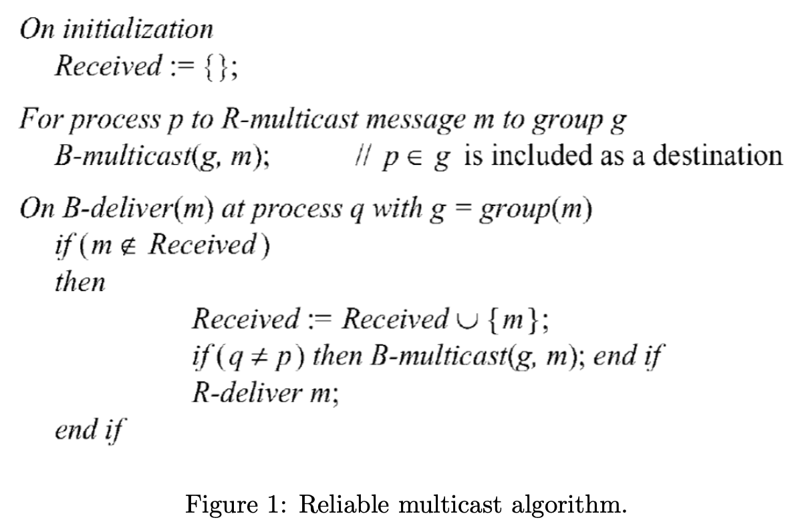
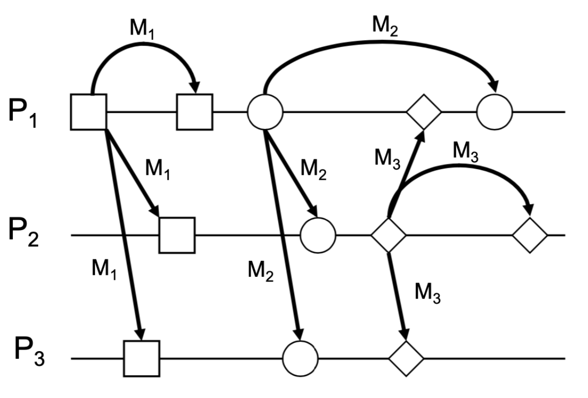

# COMP90020 Sample Exam Answer

## Question 1

Using Cristian’s method for synchronizing clocks where we use a time server, we record the round-trip time and the timestamp returned by the server as 4 sec and 09:55:28 (hh:mm:ss), respectively.

1. What time should we set the local clock to? **(1 mark)**
2. What is the accuracy of this setting? **(1 mark)**
3. What is the accuracy of the setting if we know for a fact that the minimum round trip time is 1 second? **(1 mark)**

Show your calculations and notation clearly.

--

1. 09:55:30
2. $\pm 2$ sec
3. $\pm 1$ sec

## Question 2

Why is the implementation of a reliable failure detector only possible in a synchronous distributed system?

--

In asynchronous system, we don't know the bound of transmission delay, which means that we cannot determine whether the response timeout is caused by a process crash or the network is slow.

## Question 3

Give an example execution of the ring-based mutual exclusion algorithm to show that processes are not necessarily granted entry to the critical section in happened-before order.

## Question 4

Consider a set of distributed processes p1, p2, and p3 that use the Ricart and Agrawala’s algorithm for mutual exclusion. Assume that p3 is currently in the critical section (CS) and there is no other process in the WANTED state.

1. (A)  Now consider requests from p1 and p2 (in that order) to enter CS. Show the state and queue entries at each process. (1.5 marks)
2. (B)  Now, p3 exits the CS and informs all relevant processes that CS is released. Show the state and queue entries at each process, at this stage. (1.5 marks)

--

Suppose p1's timestamp < p2's timestamp

**A.**

p1

state = WANTED

queue = <q2-req>

p2

state = WANTED

queue = <>

p3

state = HELD

queue = <q1-req, q2-req>

**B.**

p1

state = HELD

queue = <q2-req>

p2

state = WANTED

queue = <>

p3

state = RELEASED

queue = <>

## Question 5

In a certain system, each process typically uses a critical section many times before another process requires it. Explain why Ricart and Agrawala’s multicast-based mutual exclusion algorithm is inefficient for this case, and describe how to improve its performance. Does your adaptation satisfy liveness condition ME2?

--

In Ricart and Agrawala's multicast based mutualecxclusion algorithm, each access for the critical state need (2N - 1) messages to confirm. If each of the process need to use a critical section K times, it need K * N * (2N -1) messages, which is expensive.

Instead, we can use Maekawa's Voting Algorithm which process only need to request permission from a subset of the processed. Processes are grouped into voting sets; Voting sets have at least one overlapping process A process must collect sufficient votes to enter the CS; Sufficient means all processes in its voting set. 

Not satisfy ME2. Dead lock are possible:

1. Given three processes with V1= {p1, p2}, V2= {p2, p3}, V3 = {p3, p1} 
2. All request access to CS 
3. Construct a cyclic wait graph 
   1. p1 requests to p2, queues request from p3 
   2. p2 requests to p3, queues request from p1 
   3. p3 requests to p1, queues request from p2

## Question 6

In the following reliable multicast algorithm (Figure 1) that we saw in class, explain briefly what would happen if we were to have ‘R-deliver m’ before the ‘if (q ̸= p) then...’ statement.

 --

It may reach a situation that contradict to the aggrement property. If a process first R-deliver m then do B-multicast, it may crash after R-deliver and before B-multicast. This can lead to some correct process not deliver but some diliver.

## Question 7

The figure below (Figure 2) shows some multicast messages happening for three processes on different machines. Is the ordering of these multicast messages CO, FIFO and/or TO? Explain your answer.

--

p1 - M1, M3, M2

P2 - M1, M2, M3

P3 - M1, M2, M3

$\because$

M1->M2

M2-> M3

M1->M2->M3

$\therefore$

**CO:**

No. M1->M2->M3. But in P1 the order is M1, M3, M2

**FIFO:**

Yes. the order for M1, M2 which multicasted by P1 is correct in the three process. M3 no order require.

**TO:**

No, the order of p1 is not the same as p2 and p3.

## Question 8

Consider a distributed system involving 5 processes, p1, p2, p3, p4 and p5. Process p1 is appointed as the general for this run and its proposed value is a. Process p3 has been hijacked by a hacker, and will relay the value b to processes p2 and p5, and c to the rest. The system does not have a digital signature mechanism. Show that processes p2, p4 , and p5 can still reach an agreement. How many cycles are mandatory for reaching the agreement?

--

Not understand what circles means!

## Question 9

For distributed transactions, we discussed the one phase commit protocol. What are the disadvantages of this protocol? How can the two phase commit (2PC) protocol overcome these disadvantages? Explain your answer.

--

The problem of one-phase commit protocol is that it does not allow a server to make a unilateral decision to abort a transaction when the client requests a commit. 

In the first phase of the two-phase commit protocol, the coordinator need to get vote result from participants. This give the chance to the participants to do unilateral decision since they can reply abort to the coordinator. If one of the paticipants reply abort, the coordinator will do abort.

## Question 10

Consider the following wait-for-graph (Figure 3). Show that the system is in a deadlock situation.

What is the most efficient way (in terms of number of terminations) to get out of the deadlock?

--

Two deadlock: T2->T3->T6->T5->T2, T2->T6->T5->T2

Abort T2.

## Question 11

Consider transactions W and Y (Figure 4):

show a concurrent execution of these transactions that has a dirty read.

--

| Transaction w     | transaction y      |
| ----------------- | ------------------ |
| x = read(A)       |                    |
| y = read(B)       |                    |
| Write(A, A - 1)   |                    |
|                   | y = read(B)        |
|                   | x = read(A)        |
|                   | write(C, A + B)    |
|                   | write(B, B - A)    |
|                   | commit transaction |
| Write(B, B+ 1)    |                    |
| abort transaction |                    |

## Question 12

Explain how optimistic concurrency control can increase the system concurrency? In what situation optimistic concurrency control fails to enhance the systems throughput?

--

In optimistic concurrency, it assume that the likelihood of two clients' transactions accessing the same object is low. By always allow the transaction to do the process in its tentative version without any form of checking, and validate them at the end, those no conflict transaction can do at the same time which increases concurrency. Moveover, no lock maintenance overhead will occur. 

In the situation that when there are few conflicts, optimistic concurrency control is relatively efficient.